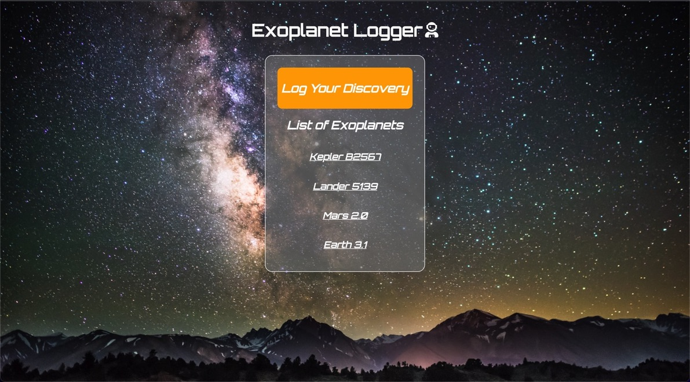
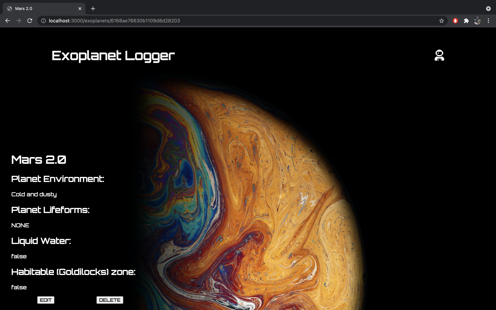
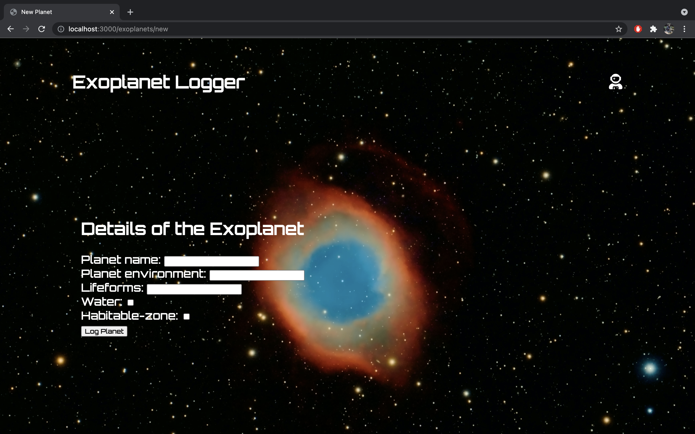

# Exoplanet Logger
This is a Full-CRUD, Full-Stack Restful application utilizing MongoDB for a database with a purpose to allow users to record exo-planets they discover in the cosmos. They can indicate features of the discovery such as if it has water, if they think it is potentially habitable for life, among other descriptive features! Below you will find a link to the live application!
## Deployed App Link
https://exoplanet-logger.herokuapp.com/exoplanets
## Technologies used
- HTML
- CSS
- Javascript
- Express
- MongoDB
- Mongoose
- Markdown
- <https://fonts.google.com>
- <https://unsplash.com/>
- <https://fontawesome.com/>

## Screenshots

## Enhancements for the future
-Authentication to create/edit a planet.