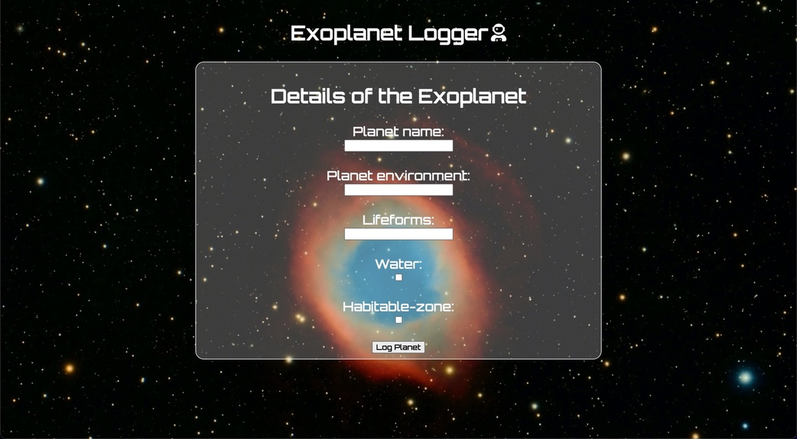

# Exoplanet Logger
An app to record to your exoplanet discoveries.

## Technologies used
- HTML
- CSS
- Javascript
- Markdown
- <https://fonts.google.com>

## Screenshots

## Deployed App Link

## Enhancements for the future
Have a random exo-planet picture be displayed everytime you create or edit a planet.